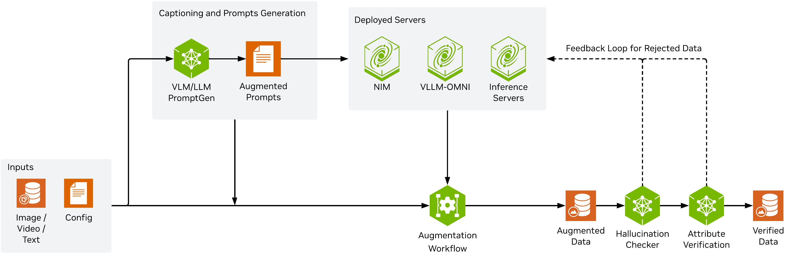

<!--
SPDX-FileCopyrightText: Copyright (c) 2026 NVIDIA CORPORATION & AFFILIATES. All rights reserved.
SPDX-License-Identifier: Apache-2.0
-->

# Physical AI Data Factory (PAIDF) Augmentation Pipeline

This pipeline augments generic camera data through generative AI models. It supports multi-modal inputs such as image, video, and text, and produces augmented outputs through backends such as Cosmos Transfer NIM, Cosmos Predict NIM, image-edit, and other models (Veo 3.1, Gemma, Gemini, etc). Optional steps include captioning, template-based prompt generation, data preprocessing, and data verification.

Every model is reached over a **remote HTTP endpoint**: each backend is described by one entry in the config's `endpoints` list, so adding or swapping a model is usually just a config change rather than a code change. No model weights ship in the image: any server that speaks an OpenAI-compatible API (vLLM, vLLM-OMNI) or the NIM `/v1/infer` contract can act as a backend, as can a hosted service such as Gemini 3 Pro Image or Veo 3.1. That keeps the container lightweight and makes it easy to plug in your own models for augmentation.

## Overview

The pipeline takes two inputs — source media (image, video, or text) and a single YAML config — and returns verified augmented data. The config drives every stage, so a run is fully defined by that one file.

An optional captioning stage sends the source media to a VLM/LLM to produce the augmented prompts that steer generation; prompts can equally come from a template filled with variables, from fixed text, or sampled from a prompt file. The augmentation workflow then passes the media and its prompt to a deployed model server — a NIM, a vLLM-OMNI server, or any other OpenAI-compatible inference server — which returns the augmented data.

Two optional evaluators gate that output: a hallucination checker flags motion artifacts absent from the source, and attribute verification confirms the requested attributes actually appear. Samples failing either check are fed back to the generation servers for another attempt with an incremented seed; samples that pass are written out as verified data.

<p align="center">
  
</p>

## Supported endpoints

Transport is a pluggable **adapter** — the API contract an endpoint speaks. Any server speaking one of these contracts works: match the route your server exposes, then set that `adapter:` on the endpoint.

| API route | `adapter:` | Roles | Example config |
| --- | --- | --- | --- |
| `/v1/infer` | `nim` | **`video_transfer`**, **`video_predict`**, **`image_edit`**, `image2video` | `config_video_transfer_CT25_nim.yaml` |
| `/v1/chat/completions` | `openai.chat.completions` | **`vlm`**, **`llm`**, `image_edit`, `video_predict` | `config_image_edit_attribute_chat_api.yaml` |
| `/v1/images/edits` | `openai.images.edits` | `image_edit` | `config_image_edit_attribute_images_api.yaml` |
| `/v1/videos/sync` | `openai.video.sync` | **`image2video`**, `video_transfer` | `config_image2video_cosmos3.yaml` |
| `/videos` → poll → `/content` | `openai.video.async` | `image2video` | `config_image2video_veo31.yaml` |

**Bold** roles take that adapter by default; set `adapter:` only to override. Tested backends: self-hosted NVIDIA NIM (Cosmos Transfer 2.5, image-edit), local vLLM / vLLM-OMNI (Qwen, Cosmos 3 Super), and hosted NVIDIA APIs (Gemma, Gemini, Veo 3.1). Cosmos Predict 2.5 is supported over `nim` as well, but ships no example config yet. Each row lists one representative config — see the [config cookbook](configs/cookbook/README.md) for the full set, grouped by use case under `configs/cookbook/<use-case>/`.

## Requirements

- Docker. Inference itself needs **no GPU** and no NVIDIA Container Runtime — every model runs on your remote endpoints. Add the [NVIDIA Container Runtime](https://docs.nvidia.com/datacenter/cloud-native/container-toolkit/install-guide.html) and `--gpus` only for these local post-processing steps:
  - **Decoding H.264 video** — the evaluators (`hallucination_check`, `attribute_verification`) and `data_processing.transcode`. The image ships only the hardware `h264_cuvid` decoder (software AVC decode is off for licensing), so H.264 has to go through NVDEC. Whether you hit this depends on your generation backend: the Cosmos Transfer NIM emits VP9, which decodes in software, while vLLM-OMNI emits H.264.
  - **`data_processing.alignment`** — its mutual-information search is cupy-only with no CPU fallback, so this post-processor requires a GPU outright. Used mainly by the Defect Image Generation use case.

  Video *encoding* never needs a GPU: `transcode` writes VP9 with the software `libvpx-vp9` encoder (`h264_nvenc` is deliberately not built into the image).
- Reachable endpoint URLs for every role your config uses. A generation-role endpoint plus, for configs that caption or verify, a `vlm` and/or `llm` endpoint. Endpoints can be local (e.g. vLLM, a local NIM) or remote (e.g. NVIDIA hosted APIs).
- API keys only for endpoints that require auth, passed via environment variables named by each endpoint's `api_key_env` (never hardcoded in YAML). Local endpoints need none.
- *(Optional)* [multi-storage-client](https://nvidia.github.io/multi-storage-client/) configuration if your data lives in S3, GCS, Azure, or other remote storage.

## Installation

### Clone the repository

```bash
git clone https://github.com/NVIDIA/paidf-augmentation.git
cd paidf-augmentation
```

The pipeline entrypoint is `modules/cli.py` (run inside the container — see [Usage](#usage)).

### Set up the API keys

Skip this section for a fully local, unauthenticated deployment — local vLLM servers and local NIMs need no key.

Each endpoint names its own environment variable through `api_key_env`. The key itself is never written in YAML, so it cannot leak through a CLI override or an error log:

```yaml
endpoints:
  - id: llm_gemma
    role: llm
    url: "https://integrate.api.nvidia.com/v1"
    model: "google/gemma-4-31b-it"
    api_key_env: NVIDIA_API_KEY    # the env var NAME, never the key itself
```

A key resolves in this order: the variable named by `api_key_env` → the role's default variable → no key. So `api_key_env` only needs setting when an endpoint uses something other than its role default:

| Role | Default variable |
| --- | --- |
| `vlm` | `VLM_API_KEY` |
| `llm` | `LLM_API_KEY` |
| `image_edit`, `image2video`, `video_transfer`, `video_predict` | `BUILD_NVIDIA_API_KEY` |

If `api_key_env` names a variable that happens to be unset, resolution falls back to the role default rather than silently sending no key. A remote endpoint that resolves no key at all logs a warning, since the next call will almost certainly 401.

**Passing keys into the container.** Either put them in an env file:

```bash
cat > ./examples/.env <<'EOF'
# Only the variables your configs actually name. Local endpoints need none.
VLM_API_KEY=<your-vlm-api-key>
LLM_API_KEY=<your-llm-api-key>
BUILD_NVIDIA_API_KEY=<your-nvidia-api-key>  # role default for the generation roles
NVIDIA_API_KEY=<your-nvidia-api-key>        # hosted NVIDIA (integrate.api.nvidia.com, inference-api)
VEO_API_KEY=<your-veo-api-key>              # Veo 3.1 image-to-video
GEMINI_API_KEY=<your-gemini-api-key>        # hosted Gemini image edit

# Optional
LOG_LEVEL=INFO
EOF

docker run --rm --network host --env-file examples/.env ...
```

…or forward an already-exported variable. Under `sudo`, `-E` is required or the variable will not reach Docker:

```bash
export VEO_API_KEY=<your-veo-api-key>
sudo -E docker run --rm --network host -e VEO_API_KEY ...
```

Two things that commonly trip people up: `--env-file` makes Docker fail outright if the file does not exist, so omit the flag entirely for keyless runs; and the `NGC_API_KEY` used to pull and start a NIM server is for that server's own container — the augmentation container never reads it.

> Endpoint URLs and model names belong in each config's `endpoints:` list, not in the env file. The legacy `VLM_ENDPOINT_URL` / `LLM_ENDPOINT_URL` / `*_ENDPOINT_MODEL` variables still override the **captioning and verification** consumers, but generation endpoints always come from `endpoints:`.

### Optional storage configuration

The pipeline uses [multi-storage-client](https://nvidia.github.io/multi-storage-client/) for unified local and cloud I/O. Configure it only when your configs reference remote paths (`s3://`, `gs://`, `az://`, or `https://`).

Provide configuration in one of these ways:

- Create `examples/secrets.json` and mount it to `/var/secrets/secrets.json`
- Set `MULTISTORAGECLIENT_CONFIGURATION` as an environment variable

Example `examples/secrets.json`:

```bash
cat > ./examples/secrets.json << 'EOF'
{
  "BUILD_NVIDIA_API_KEY": "<your-api-key>",
  "MULTISTORAGECLIENT_CONFIGURATION": {
    "profiles": {
      "<your-profile-name>": {
        "storage_provider": {
          "type": "s3",
          "options": {
            "base_path": "<your-base-path>",
            "region_name": "<your-region>",
            "endpoint_url": "<your-endpoint-url>",
            "infer_content_type": true
          }
        },
        "credentials_provider": {
          "type": "S3Credentials",
          "options": {
            "access_key": "<your-access-key>",
            "secret_key": "<your-secret-key>"
          }
        }
      }
    },
    "path_mapping": {
      "<your-https-bucket-url>/": "msc://<your-profile-name>/",
      "s3://<your-bucket>/": "msc://<your-profile-name>/"
    }
  }
}
EOF
```

If you do not provide storage configuration, the pipeline uses local filesystem paths.

## Usage

Commands below assume your user can talk to the Docker daemon; prefix them with `sudo` if not (and use `sudo -E` when forwarding exported environment variables).

### Build the Docker image

The pipeline ships a single endpoint-only image (remote-API inference, no local Cosmos/torch). From the repository root:

```bash
DOCKER_BUILDKIT=0 docker build -t paidf-augmentation:1.1.0 -f docker/Dockerfile .
```

The image source-builds FFmpeg, Python, OpenCV, and PyAV against a restricted codec allow-list, so the first build takes a while. Release builds are validated with the legacy builder (`DOCKER_BUILDKIT=0`).

`examples/docker-compose.yml` wraps the build and run steps below if you prefer Compose.

### Deploy the model endpoints

The container calls models over HTTP, so bring up the endpoints your config names before running it. A first run of `config_video_transfer_CT25_nim.yaml` needs three — a VLM, an LLM, and Cosmos Transfer 2.5 — each pinned to its own GPU:

```bash
# VLM (captioning + attribute verification) on :8000
docker run -d --name vlm --runtime nvidia --gpus '"device=0"' --ipc=host -p 8000:8000 \
  -e NVIDIA_DRIVER_CAPABILITIES=compute,utility,video \
  nvcr.io/nvidia/vllm:26.05.post1-py3 \
  vllm serve Qwen/Qwen3.6-27B-FP8 --host 0.0.0.0 --port 8000 \
    --trust-remote-code --max-model-len 32768 --dtype auto

# LLM (prompt generation + MCQ questions) on :8002
docker run -d --name llm --runtime nvidia --gpus '"device=1"' --ipc=host -p 8002:8002 \
  -e NVIDIA_DRIVER_CAPABILITIES=compute,utility,video \
  nvcr.io/nvidia/vllm:26.04-py3 \
  vllm serve Qwen/Qwen2.5-14B-Instruct --host 0.0.0.0 --port 8002 --max-model-len 16384

# Cosmos Transfer 2.5 NIM on :8008 — get an NGC key from
# https://build.nvidia.com/nvidia/cosmos-transfer2_5-2b
docker run -d --name cosmos-transfer25 --gpus '"device=2"' --ipc=host \
  --ulimit memlock=-1 --ulimit stack=67108864 --ulimit nofile=1048576:1048576 --shm-size=16g \
  -e NGC_API_KEY=<your-ngc-key> \
  -p 8008:8000 nvcr.io/nim/nvidia/cosmos-transfer2.5-2b:latest
```

Each returns `200` once it is ready — vLLM on `/health`, a NIM on `/v1/health/ready`:

```bash
curl -s -o /dev/null -w '%{http_code}\n' http://localhost:8000/health
curl -s -o /dev/null -w '%{http_code}\n' http://localhost:8002/health
curl -s -o /dev/null -w '%{http_code}\n' http://localhost:8008/v1/health/ready
```

Model servers take minutes to load; a run started too early fails on connection refused. Other backends follow the same shape — see each cookbook config's `endpoints:` block for the ports and models it expects.

### Run inference

The image's entrypoint is the CLI (`uv run --no-sync /workspace/modules/cli.py`), so pass CLI arguments directly. Mount your `configs/` and `data/`, then select a config:

```bash
docker run --rm --network host \
  --gpus '"device=3"' \
  -v "$(pwd)/configs:/workspace/configs" \
  -v "$(pwd)/data:/workspace/data" \
  paidf-augmentation:1.1.0 \
  --config configs/cookbook/video-data-augmentation/config_video_transfer_CT25_nim.yaml \
  endpoints.2.timeout=3600 \
  pipeline.retry=2
```

- `--gpus` is pinned to a GPU **not** running a model server — the evaluators decode the input video through NVDEC, and sharing a saturated GPU can crash it. H.264 decoding is hardware-only in this image (`h264_cuvid`); no software AVC decoder is included, so H.264 has no CPU fallback. MPEG-4 Part 2, MJPEG, and VP9 retain software decoders. Drop the flag entirely if your config runs no evaluators, no `data_processing.alignment`, and decodes no H.264 (see [Requirements](#requirements)).
- `--network host` lets the container reach endpoints on the host's `localhost`. When all your endpoints are remote URLs, prefer the default bridge network (see the *Security Notes* in [pipeline-operations.md](skills/paidf-augmentation/references/pipeline-operations.md#security-notes)).
- Add `--env-file examples/.env` when an endpoint needs an API key (see [Set up the API keys](#set-up-the-api-keys)). It is omitted here because a local, unauthenticated deployment needs no keys, and `--env-file` fails if the file does not exist.
- If you use cloud storage, also mount your secrets file: `-v "$(pwd)/examples/secrets.json:/var/secrets/secrets.json:ro"`.

`config_video_transfer_CT25_nim.yaml` is a good first run: VLM captioning → LLM prompt generation → Cosmos Transfer 2.5 → hallucination + attribute checks. Before running: (1) point its `endpoints:` URLs at your own `vlm`/`llm`/`video_transfer` deployments, and (2) supply an input video. The config defaults to `/workspace/data/sample_input.mp4` (the one clip tracked in `data/`); swap in your own clip via `data.0.inputs.rgb` — it must be yuv420p / tv-range, since the CT2.5 NIM rejects full-range `yuvj420p`.

A successful run writes `output.mp4`, `output.txt` (the generation prompt), and `metadata.json` (prompt, variable selections, input/output paths, and one block per evaluator) under `data/video/output/`, then exits `0`. Because `pipeline.evaluation.strict` defaults to `true`, a failing evaluator instead logs `Sample evaluation FAILED (output retained for inspection)` and exits `1`, leaving the artifacts on disk for inspection. `pipeline.retry` (default `1`) is the number of retries after a failed check, not the total attempt count — with the default you get one first try plus one retry.

Override any config value on the command line (OmegaConf dot-list syntax). Endpoints are a list, so address them positionally — in this config `0` is the VLM, `1` the LLM, and `2` the generation backend:

```bash
docker run --rm --network host \
  --gpus '"device=3"' \
  -v "$(pwd)/configs:/workspace/configs" -v "$(pwd)/data:/workspace/data" \
  paidf-augmentation:1.1.0 \
  --config configs/cookbook/video-data-augmentation/config_video_transfer_CT25_nim.yaml \
  'data.0.inputs.rgb=/workspace/data/sample_input.mp4' \
  'endpoints.0.url=http://localhost:8000/v1' \
  'endpoints.0.model=Qwen/Qwen3.6-27B-FP8' \
  'endpoints.2.url=http://localhost:8008' \
  'augmentation.parameters.seed=123'
```

> **Note:** The container runs as user `nvidia` (UID 10000), which must be able to read the mounted `configs/`/`data/` and write outputs under `data/`. Create the output directory up front and give it to that user, or the run fails on its first write:
>
> ```bash
> mkdir -p data/video/output && sudo chown 10000:10000 data/video/output
> ```
>
> Alternatively run the container as your own user so ownership matches the host — `docker run --rm --user "$(id -u):$(id -g)" ...`. Avoid world-writable mounts; if neither option works, grant access to just UID 10000 with an ACL (`setfacl -R -m u:10000:rwX data/`) rather than `chmod -R o+rwX`.

## Configuration & reference docs

Pipeline behavior is controlled by a single YAML config file with seven sections — `data`, `endpoints`, `pipeline`, `captioning`, `augmentation`, `data_processing`, and `evaluators`. The full schema, per-section examples, troubleshooting, and security guidance live in the **augmentation skill** reference docs (loaded on demand by agents, and browsable here):

- [Configuration schema & per-section examples](skills/paidf-augmentation/references/configuration-schema.md)
- [Config decision tree — model & captioning selection](skills/paidf-augmentation/references/config-decision-tree.md)
- [Captioning strategies](skills/paidf-augmentation/references/captioning-strategy-guide.md)
- [Evaluator setup](skills/paidf-augmentation/references/evaluator-setup-guide.md)
- [Troubleshooting](skills/paidf-augmentation/references/troubleshooting.md)
- Security notes — see the *Security Notes* section of [pipeline-operations.md](skills/paidf-augmentation/references/pipeline-operations.md#security-notes)

See the *Reference files* section of [`skills/paidf-augmentation/SKILL.md`](skills/paidf-augmentation/SKILL.md#reference-files) for the full index.

## Contributing

Contributions are welcome. All commits must be signed off under the [Developer Certificate of Origin](https://developercertificate.org/) — see [CONTRIBUTING.md](CONTRIBUTING.md) for sign-off instructions and the full DCO text.

## Notice

**NOTICE AND DISCLAIMER:** This software automatically retrieves, accesses or interacts with external materials. Those retrieved materials are not distributed with this software and are governed solely by separate terms, conditions and licenses. You are solely responsible for finding, reviewing and complying with all applicable terms, conditions, and licenses, and for verifying the security, integrity and suitability of any retrieved materials for your specific use case. This software is provided "AS IS", without warranty of any kind. The author makes no representations or warranties regarding any retrieved materials, and assumes no liability for any losses, damages, liabilities or legal consequences from your use or inability to use this software or any retrieved materials. Use this software and the retrieved materials at your own risk.
