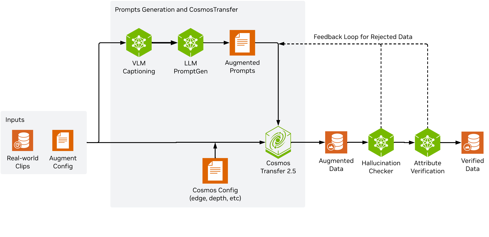

<!--
SPDX-FileCopyrightText: Copyright (c) 2026 NVIDIA CORPORATION & AFFILIATES. All rights reserved.
SPDX-License-Identifier: Apache-2.0
-->

# Physical AI Data Factory (PAIDF) Augmentation Pipeline

This pipeline processes generic camera data through generative AI models. It supports multi-modal inputs such as RGB, depth, edges, and segmentation, and can produce augmented outputs through models such as COSMOS Transfer and image-edit backends. Optional steps include captioning, template-based prompt generation, and verification.

## Overview

The pipeline is designed for generic data augmentation. Input media can be captioned, transformed into template variables, turned into prompts, and then passed to a generation backend. You can also enable hallucination detection and attribute verification.

<p align="center">
  
</p>

**High-level flow:**

1. **Captioning** — Produce a generation prompt from the input media (VLM, LLM, fixed text, or sampled from a file)
2. **Generation** — Run a backend such as `cosmos-transfer2.5`, `cosmos-predict`, or `image-edit`
3. **Hallucination check** (optional) — Detect motion artifacts not present in the original
4. **Attribute verification** (optional) — Generate verification questions and answer them with a VLM


## Requirements

- NVIDIA GPU (Ampere, Hopper, or Blackwell) and a recent NVIDIA driver
- Docker with the [NVIDIA Container Runtime](https://docs.nvidia.com/datacenter/cloud-native/container-toolkit/install-guide.html) installed
- A HuggingFace account with the NVIDIA Open Model License accepted on the Cosmos repos you plan to use (see [HuggingFace access](#huggingface-access) below)
- A VLM and/or LLM endpoint — required for most configs that use VLM/LLM captioning or verification. Not required when using `captioning.llm.text` (fixed text prompt) or `captioning.llm.file_path` (sample from a file).
- *(Optional)* [multi-storage-client](https://nvidia.github.io/multi-storage-client/) configuration if your data lives in S3, GCS, Azure, or other remote storage

## Installation

### Clone the repository

```bash
git clone <repository-url>
cd augmentation
```

Run the CLI with:

```bash
uv run modules/cli.py
```

### Set up `examples/.env`

Create `examples/.env` and replace the placeholders with your values:

```bash
cat > ./examples/.env <<'EOF'
# Required when your config uses VLM/LLM captioning/verification
# VLM and LLM endpoints can be local (e.g. vLLM, Ollama) or remote (e.g. NVIDIA NVCF). API keys are only needed for endpoints that require auth.
VLM_ENDPOINT_URL=<your-vlm-base-url>
VLM_ENDPOINT_MODEL=<your-vlm-model>
VLM_API_KEY=<your-vlm-api-key>
LLM_ENDPOINT_URL=<your-llm-base-url>
LLM_ENDPOINT_MODEL=<your-llm-model>
LLM_API_KEY=<your-llm-api-key>

# Required at runtime to pull Cosmos model checkpoints from HuggingFace (see HuggingFace access below)
HF_TOKEN=<your-hf-token>

# Optional
LOG_LEVEL=INFO

# Only needed if using gradio executor (cosmos-transfer or cosmos-predict in gradio mode)
# COSMOS_ENDPOINT_URL=<your-cosmos-base-url>
# COSMOS_ENDPOINT_MODEL=<your-cosmos-model>

# Only needed if using an image-edit model
# IMAGE_EDIT_ENDPOINT_URL=<your-image-edit-base-url>
# IMAGE_EDIT_ENDPOINT_MODEL=<your-image-edit-model>
EOF
```

### HuggingFace access

The Cosmos model repos on HuggingFace are gated under the NVIDIA Open Model License. To use `HF_TOKEN`:

1. Log in to [huggingface.co](https://huggingface.co)
2. Visit each repo you plan to use and accept the license (access is granted instantly):
    - [nvidia/Cosmos-Transfer2.5-2B](https://huggingface.co/nvidia/Cosmos-Transfer2.5-2B)
    - [nvidia/Cosmos-Predict2.5-2B](https://huggingface.co/nvidia/Cosmos-Predict2.5-2B)
3. Create a read token at [huggingface.co/settings/tokens](https://huggingface.co/settings/tokens) and set it as `HF_TOKEN` in `examples/.env`.

### Optional storage configuration

The pipeline uses [multi-storage-client](https://nvidia.github.io/multi-storage-client/) for unified local and cloud I/O. Configure it only when your configs reference remote paths.

Provide configuration in one of these ways:

- Create `examples/secrets.json` and mount it to `/var/secrets/secrets.json`
- Set `MULTISTORAGECLIENT_CONFIGURATION` as an environment variable

Example `examples/secrets.json`:

```bash
cat > ./examples/secrets.json << 'EOF'
{
  "BUILD_NVIDIA_API_KEY": "<your-api-key>",
  "MULTISTORAGECLIENT_CONFIGURATION": {
    "profiles": {
      "<your-profile-name>": {
        "storage_provider": {
          "type": "s3",
          "options": {
            "base_path": "<your-base-path>",
            "region_name": "<your-region>",
            "endpoint_url": "<your-endpoint-url>",
            "infer_content_type": true
          }
        },
        "credentials_provider": {
          "type": "S3Credentials",
          "options": {
            "access_key": "<your-access-key>",
            "secret_key": "<your-secret-key>"
          }
        }
      }
    },
    "path_mapping": {
      "<your-https-bucket-url>/": "msc://<your-profile-name>/",
      "s3://<your-bucket>/": "msc://<your-profile-name>/"
    }
  }
}
EOF
```

If you do not provide storage configuration, the pipeline uses local filesystem paths.

## Usage

### Build and launch the Docker container

From the repository root:

```bash
docker build -t paidf-augmentation:latest -f docker/Dockerfile .

docker run -it --rm \
  --network host \
  --runtime nvidia \
  -e NVIDIA_VISIBLE_DEVICES=0 \
  -e NVIDIA_DRIVER_CAPABILITIES=compute,utility \
  --env-file examples/.env \
  -v "$(pwd)/modules:/app/modules" \
  -v "$(pwd)/configs:/app/configs" \
  -v "$(pwd)/data:/app/data" \
  --entrypoint /bin/bash \
  paidf-augmentation:latest
```

If you use cloud storage, also mount your secrets file:

```bash
-v "$(pwd)/examples/secrets.json:/var/secrets/secrets.json:ro"
```

> **Note:** The container runs as user `nvidia` (UID 10000). Mounted host directories must be readable (and `data/` writable) by other users. Before launching the container, run:
>
> ```bash
> chmod -R o+rX configs/ modules/ examples/
> chmod -R o+rwX data/
> ```
>
> `data/` needs write permission so the pipeline can save outputs.

Inside the container, your working directory is `/app`.

### Run inference

For a first-run validation, use the starter config. It uses the bundled sample input at `data/sample_input.mp4` and runs the full pipeline: VLM captioning, LLM prompt generation, Cosmos Transfer 2.5 inference, and hallucination check. VLM and LLM endpoints are read from `VLM_ENDPOINT_URL` and `LLM_ENDPOINT_URL` in `examples/.env`:

```bash
uv run modules/cli.py --config configs/config_starter.yaml
```

On success, the generated video is written to `data/sample_output.mp4`, along with `sample_caption.txt` and `sample_metadata.json`.

Other example configs use placeholder data paths (for example, `/path/to/input/rgb.mp4`). Edit the config or override paths on the command line:

```bash
uv run modules/cli.py --config configs/config_carla_vlm_llm.yaml \
  'data.0.inputs.rgb=<input-media-path>' \
  'data.0.output.media=<output-media-path>'
```

`output.media` is the preferred output key. Older configs that have not been migrated may still use `output.video`; the CLI supports both.

See the `configs/` directory for examples covering Cosmos Transfer, Cosmos Predict, and Qwen Image Edit, with various captioning, generation, and verification setups.

## Configuration

Pipeline behavior is controlled by a single YAML config file. The main sections are:

| Section        | Purpose                                                                              |
| -------------- | ------------------------------------------------------------------------------------ |
| `data`         | Input and output paths for media, captions, and metadata                             |
| `endpoints`    | URLs and models for VLM, LLM, and generation services                                |
| `pipeline`     | Retry behavior, evaluation settings, and logging                                     |
| `captioning`   | How the initial caption or generation prompt is created (VLM/LLM/text/file)          |
| `augmentation` | Generation backend (`cosmos-transfer2.5`, `cosmos-predict`, `image-edit`) and parameters |
| `evaluators`   | Optional ordered list: `hallucination_check`, `attribute_verification`               |

### Captioning

The `captioning` section supports several strategies. The pipeline infers which captioner to use from the sub-sections you set:

- `captioning.vlm` only — VLM describes the input media (VLMCaptioner)
- `captioning.llm` only — LLM generates a prompt from configured variables (LLMCaptioner)
- `captioning.vlm` + `captioning.llm` — VLM caption and LLM prompt generation (VLMLLMCaptioner)
- `captioning.llm.text` — fixed text prompt (TextCaptioner; no LLM endpoint required)
- `captioning.llm.file_path` — sample a prompt from a file (FileCaptioner; no LLM endpoint required)

Example `vlm + llm` captioning:

```yaml
captioning:
  vlm:
    parser: "instruct"
    system_prompt: "You are a helpful assistant that describes video content."
    user_prompt: "Describe this video scene."
    parameters:
      temperature: 0.3
      max_tokens: 4096
  llm:
    system_prompt: "Generate a transformation prompt from the caption and target attributes."
    parameters:
      temperature: 0.3
      max_tokens: 512
    variables:
      weather_condition: ["raining"]
      lighting_condition: ["night"]
```

### Augmentation

The `augmentation` section dispatches on `model.name`:

- `cosmos-transfer2.5` — multi-control video transformation
- `cosmos-predict` — text2world / image2world / video2world generation
- `image-edit` — image editing

Each model supports executor types (`local`, `gradio`, or `passthrough`, depending on the model). Example:

```yaml
augmentation:
  model:
    name: "cosmos-transfer2.5"
    version: "ct2.5"
    executor_type: "local"
  parameters:
    sigma: 90
    seed: 42
    guidance: 3
    num_steps: 35
  local_parameters:
    num_processes: 1
  modalities:
    vis: 1.0
```

### Evaluators

The `evaluators` section is an ordered list of validators run after generation. Supported entries: `hallucination_check`, `attribute_verification`. If an evaluator fails, the sample can be retried (`pipeline.retry`).

Example:

```yaml
evaluators:
  - hallucination_check:
      enabled: true
      threshold: 0.682
  - attribute_verification:
      enabled: true
      question_generation:
        system_prompt: "Generate verification questions."
        parameters:
          temperature: 0.2
          max_tokens: 2048
      vlm_verification:
        system_prompt: "Answer with a single letter."
        parameters:
          temperature: 0.0
          max_tokens: 10
```

Example evaluation result in metadata:

```json
{
  "passed_attribute_check": true,
  "details": {
    "summary": {
      "total_checks": 3,
      "passed_checks": 3,
      "failed_checks": 0
    }
  }
}
```

## Troubleshooting

### Multi-GPU runs hang on shared or multi-tenant machines

Some PCIe-based GPU machines ship with PCIe Access Control Services (ACS) enabled in BIOS, which silently blocks NCCL's default GPU-to-GPU transport. If a multi-GPU run (`num_processes >= 2`) hangs at startup with no GPU activity, set `NCCL_P2P_DISABLE=1` and try again:

```bash
docker run ... -e NCCL_P2P_DISABLE=1 ... paidf-augmentation:latest ...
```

This forces NCCL to relay traffic through CPU shared memory. Performance is slightly lower, but the setting works reliably. NVLink systems are not affected.

## Contributing

Contributions are welcome. All commits must be signed off under the [Developer Certificate of Origin](https://developercertificate.org/) — see [CONTRIBUTING.md](CONTRIBUTING.md) for sign-off instructions and the full DCO text.

## Notice

**NOTICE AND DISCLAIMER:** This software automatically retrieves, accesses or interacts with external materials. Those retrieved materials are not distributed with this software and are governed solely by separate terms, conditions and licenses. You are solely responsible for finding, reviewing and complying with all applicable terms, conditions, and licenses, and for verifying the security, integrity and suitability of any retrieved materials for your specific use case. This software is provided "AS IS", without warranty of any kind. The author makes no representations or warranties regarding any retrieved materials, and assumes no liability for any losses, damages, liabilities or legal consequences from your use or inability to use this software or any retrieved materials. Use this software and the retrieved materials at your own risk.
